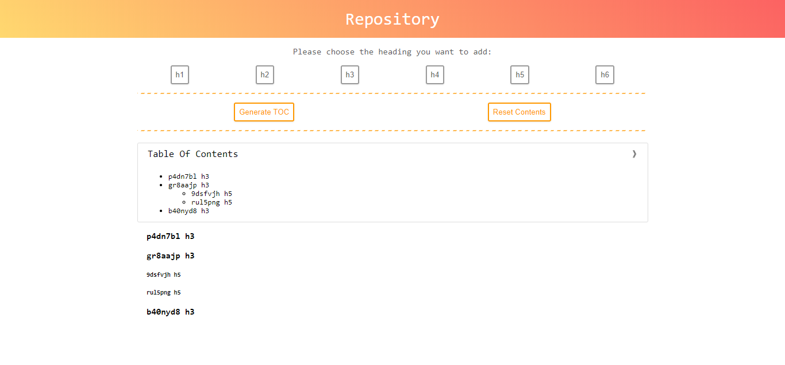

## TOC Generator
This is a simple TOC generator for blog posts, its process logic is: Select all headings expect those inside `blockquote` tags and generate the table of contents.

### Usage
1. Include the `toc-generator.js` file to the page
2. Add all files in `toc-assets/` to make the TOC styled
3. Write the placeholder `[TOC]` as the first paragraph in your post

### Demo
Both [non-jquery version](https://demos.kingsleyxie.cn/toc-generator/) and [jquery version](https://demos.kingsleyxie.cn/toc-generator/jquery-version.html) are deployed on a test server, generally the effects are the same. And...any bug report is welcomed = =.

Actually they were initially used as test page for this generator.

Here is a preview picture of demo page:



More details or ideas can be found in my [blog](https://kingsleyxie.cn/implement-a-toc-generator-for-my-blog) if you are interested.

### Customization
There is a `tocConf` constant inside Javascript code:

```javascript
const tocConf = {
    "title": "Table Of Contents",
    "placeholder": "[TOC]",
    "contentWrapper": ".post-content"
};
```

Each stands for TOC title, placeholder and post content **selector**, respectively. You can change them to whatever the value you like, just make sure the `contentWrapper` selector is valid.

Other codes in the file are NOT recommended to customize.
